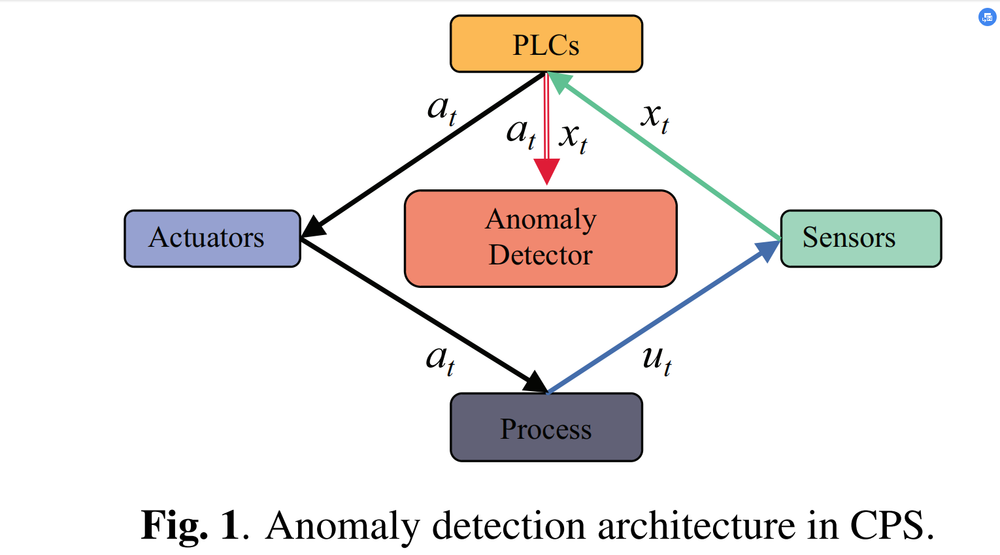
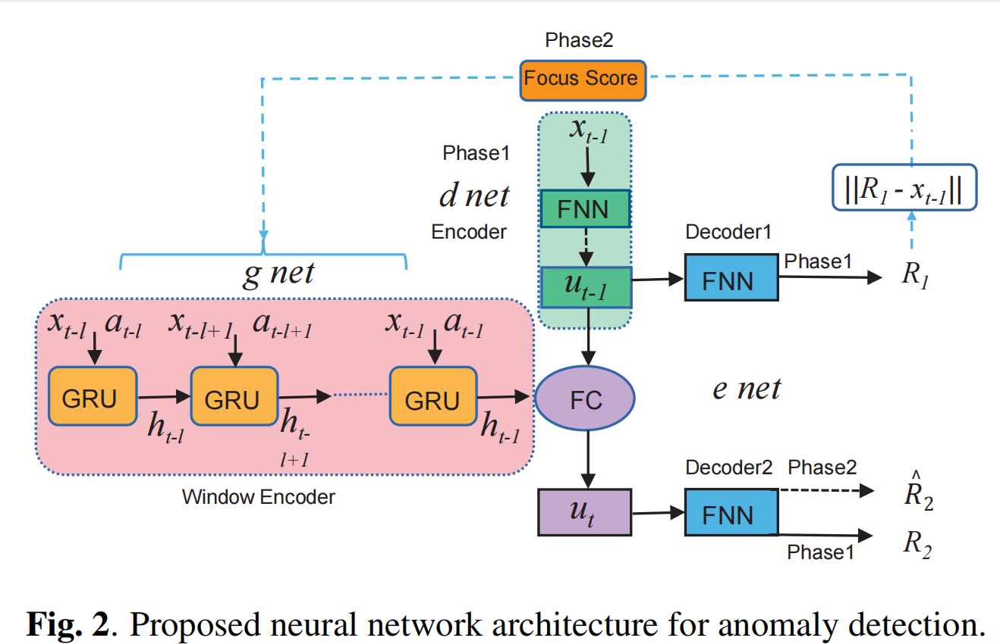

# NSIAD
### Neural System Identification Networks with Adversarial Training for Time Series Anomaly Detection in Cyber-Physical Systems


## Overview
<div style="text-align: justify;">
Detecting anomalies efficiently in multivariate time series data is crucial for modern cyber-physical systems (CPS). However, constructing a system that can efficiently and accurately identify anomalous observations for CPS is a formidable challenge. This challenge arises from several factors, including the absence of anomaly labels, high data volatility, and the need for accurate anomaly detection in highly intricate system dynamics and unidentified sensor noise. In this paper, we propose eural System Identification networks with Adversarial Training(NSIAD), a novel crafted neural network for time series anomaly detection, which uses neural system identification to capture the dynamics of the broader temporal trends with a dynamical state space model. NSIAD employs focus score-based self-conditioning to facilitate resilient multi-modal feature extraction and utilizes adversarial training to achieve stability. Additionally, model-agnostic meta-learning (MAML) enables the practical training of the model with limited data. Our extensive empirical studies on three publicly available datasets demonstrate that NSIAD significantly improves anomaly detection performance in CPS. Furthermore, the ablation study empirically illustrates the effectiveness of each component within our approach.
</div>

## Architecture
<div style="display:flex; justify-content:space-between;">
  
  
</div>

## Getting Started
#### Install dependencies (with python 3.6) 
```shell
pip install -r requirements.txt
```
## Usage
#### Run the qualitative experiment
```shell
cd experiments
python qualitative_experiment.py
```
#### Run the PUMP experiment
```shell
cd experiments
python PUMP_experiement.py
```
#### Run the WADI experiment
```shell
cd experiments
python WADI_experiement.py
```
#### Run the SWAT experiment
```shell
cd experiments
python SWAT_experiement.py
```
## Dataset
All dataset zip files are available in the [datasets](./datasets)
 folder of our repository. Simply clone our code, and you'll find the relevant dataset processing scripts there for easy usage.
## License
This project is under the Apache 2.0 license. See [LICENSE](./LICENSE.md) for details.


